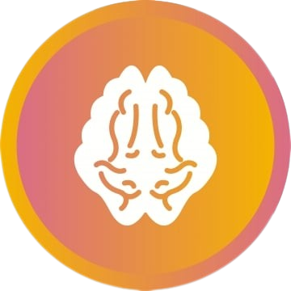
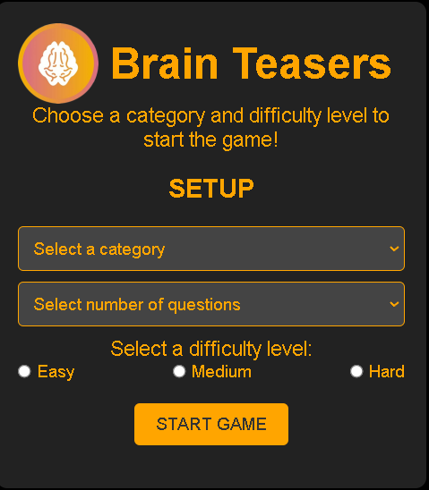
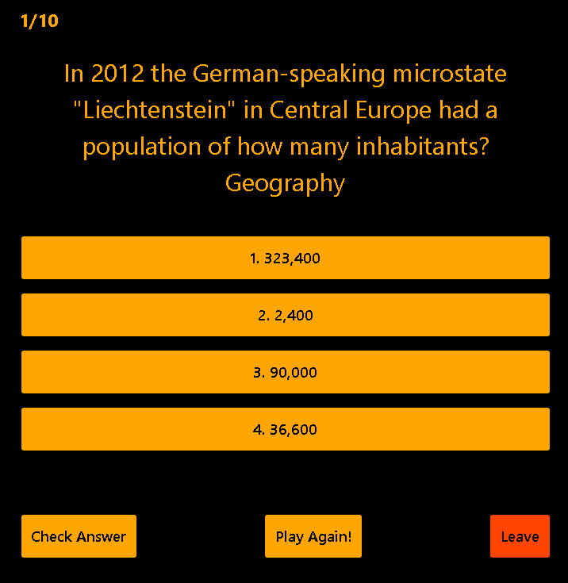

# Brain Teasers Quiz (Beta)

Welcome to the Brain Teasers Quiz project by @16alves02! This interactive web application allows users to play a quiz game with brain-teasing questions from various categories and difficulty levels. Please note that this game is currently in the beta phase, and we appreciate your feedback to help us improve it.



## Table of Contents

- [About](#about)
- [How to Play](#how-to-play)
- [Installation](#installation)
- [Feedback and Reporting Issues](#feedback-and-reporting-issues)
- [Future Plans](#future-plans)
- [Contact](#contact)

## About

The Brain Teasers Quiz is currently in beta, and it's an interactive web application that allows users to play a quiz game with brain-teasing questions from various categories and difficulty levels. As a beta version, we're actively seeking user feedback to improve and refine the gaming experience.

This project uses the Open Trivia Database API to fetch questions and test your knowledge. It's a fun and engaging way to challenge yourself, learn new facts, and help us shape the future of the game!

We welcome your feedback and suggestions as we continue to develop and enhance this quiz game.

## How to Play

1. Select a category from the dropdown menu.
2. Choose a difficulty level (easy, medium, or hard).
3. Select the number of questions you want to answer.
4. Click the "Start Game" button to begin the quiz.
5. Answer the questions by clicking on the options provided.
6. After completing the quiz, you'll see your score and have the option to play again.

# Game Menu:


# Example:


## Installation

To run this project locally, follow these steps:

1. Clone the repository to your local machine:
   ```bash
   git clone https://github.com/16alves02/brain-teasers-quiz.git
2. Navigate to the project directory:  
   cd brain-teasers-quiz
3. Open the index.html file in your web browser to access the quiz setup.
4. Enjoy the game!

# Feedback and Reporting Issues

We encourage you to provide feedback and report any issues you encounter while playing the Brain Teasers Quiz. Your input is invaluable in helping us enhance the game. You can share your thoughts and report problems through the following channels:

__GitHub Issues__: Please report any bugs, suggest improvements, or share your ideas with us.

# Future Plans

In the future, we plan to:

- Address known issues.
- Add more features.
- Improve the overall gameplay experience.

Our aim is to make the Brain Teasers Quiz even more enjoyable and challenging for our players. Stay tuned for updates!

# Contact
If you have any questions, suggestions, or feedback, please feel free to reach out to the project creator:

- GitHub: [github.com/16alves02](https://github.com/16alves02)


Enjoy the Brain Teasers Quiz! Have fun and challenge your brain with exciting questions from various categories.